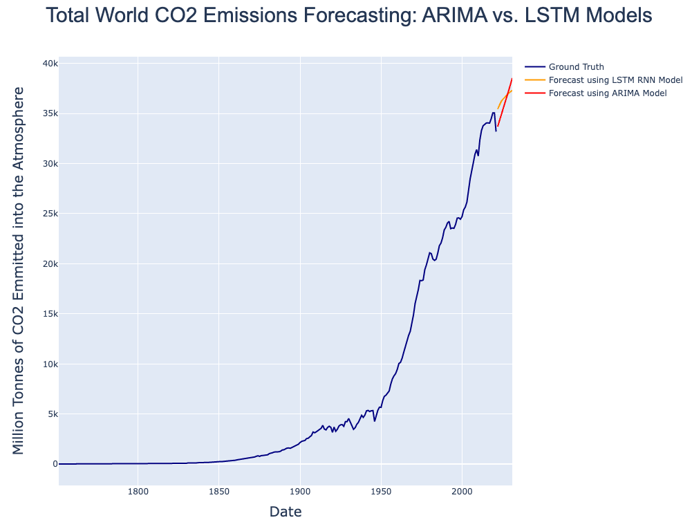

# Forecasting of World's CO2 Emissions:
## Comparison between an ARIMA Model and a LSTM Recurrent Neural Network Model for Forecasting
 

## Motivation
We talk a lot nowadays about global warming, but how bad the situation actually is? Is there any effect of so much discussion into the total world emissions? To assess these questions, I was motivated to do my own (humble) comparison between the performance of an ARIMA Model and a LSTM Recurrent Neural Network in forecasting the World's CO2 emissions. 

As this project considers the world as a one entity, I recommend to watch this video: [Who Is Responsible For Climate Change? – Who Needs To Fix It?](https://www.youtube.com/watch?v=ipVxxxqwBQw&t=1s). It is difficult for us as humans to dimension the magnitude of the problem, but the video made by [Kurzgesagt – In a Nutshell](youtube.com/channel/UCsXVk37bltHxD1rDPwtNM8Q) helps not only to understand the size of the problem, but also its complexity with regard to equal development oportunities for the countries of the world. I hope this project can not only be a nice comparison between Arima and LSTM Models in Forecasting, but I also hope that this can be an input for the discussion and awareness of the global warming situation to everyone who reads it. If you have any comment let me know :)

## Goal
- This project aims to forecasting the amount of CO2 Emissions worldwide for the next 10 years (Period 2021 - 2030)

## Results
- Clearly, both models showed an upward trend
- While the LSTM Model exhibits a deceleration over time in the behavior of the CO2 Emissions, the ARIMA Model exhibits basically a constant (but high) rate of emission
- According to an [IEA article](https://www.iea.org/news/global-co2-emissions-rebounded-to-their-highest-level-in-history-in-2021) the cumulated World's CO2 Emissions in 2021 were 36.3 Billion Tonnes. Considering this:
    - The LSTM Model forecasts 35.4 Billion Tonnes for 2021, which underestimates the real value by 2.5%
    - The ARIMA Model forecasts 33.7 Billion Tonnes for 2021, which underestimates the real value by 7.2%
- According to the information give by the [IEA article](https://www.iea.org/news/global-co2-emissions-rebounded-to-their-highest-level-in-history-in-2021), the LSTM Model would be more precise into forecasting the actual emissions for 2021. Nonetheless, the ARIMA Model starts its prediction after the decrease in emissions due to the pandemic, an therefore might be unaccurate.
- Although the LSTM Model shows more precision when compared to the 2021 declared emissions, there are practical differences between both models that are worth discussing:
    - The training process of an ARIMA Model is extremely fast. This in comparison with the training and tuning process of the LSTM Model.
    - When the availability of data, computational resources and time is restricted, an ARIMA Model is a good way of providing good overall forecasting results.
    - When the availability of data, computational resources and time is more relaxed, a LSTM Model can deliver more precise results when needed.
- Both results are concerning, and should give us a reality check of the importance of our consumption behavior and habits towards the environment.

## Methododology
- For this project two models were trained separately for forecasting: an ARIMA Model and a LSTM Model
    - An Autoregressive Integrated Moving Average (ARIMA) Model is an statistical model for times series forecasting. It is autoregressive as its predicts the future values of a time series based on its own past values. For more information and theoretical background, please refer to [Introduction to ARIMA (Duke University)](https://people.duke.edu/~rnau/411arim.htm)
    - A Long Short-Term Memory (LSTM) is a Recurrent Neural Network (RNN) which introduce cells that includes self-loops instead of a unit that simply applies an element-wise nonlinearity to th   e affine transformation of inputs (like the units of regular Neural Networks). For more information and theorical background, please refer to Chapter 10 of [Deep Learning (Goodfellow, Bengio and Courville)](https://www.deeplearningbook.org/)
    - For this personal project on a CO2 Emission time series, I chose the ARIMA and LSTM Models as both are widely used for many sequence modeling and time series. While ARIMA is a statistical method, LSTM is booming by hype that Neural Networks are experiencing in industry
- The best found ARIMA Model and the best found LSTM Recurrent Neural Network were then compared on their forecasting
- Final comments are given based on the my own learning process, experience, and results of the forecasting

## Structure of the Repository
### Data
The data used in this model is provided by Our World in Data: [CO2 Emissions - Our World in Data](https://github.com/owid/co2-data). Can be found in folder: Data.
### Models
Each model was trained and experimented individually. This can be seen in each Jupyter Notebook in folder: Models.
### Dependencies and Requirements
Env.sh is a bash file with all necessary dependencies for a virtual environment able to run this project. This is meant for a Conda Environment, but you can adapt it to your specific like if you are using virtualenv.